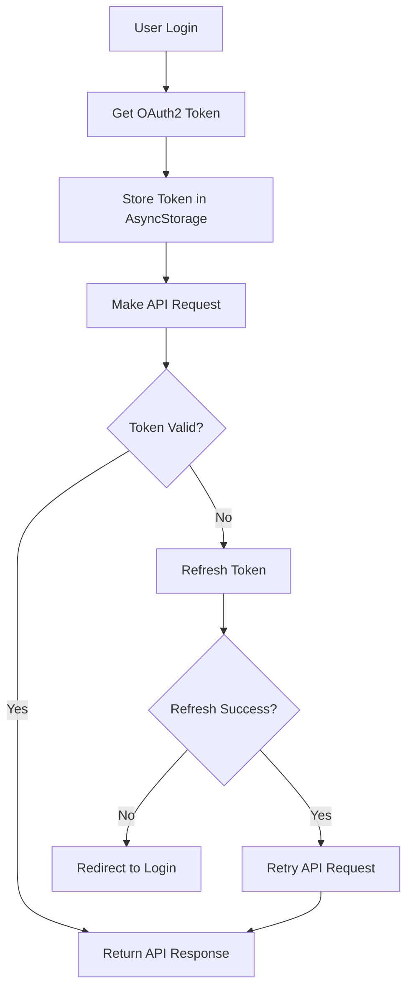

# React Native Integration Guide - Fineract OAuth2

## 📋 Tổng quan

Hướng dẫn chi tiết để tích hợp React Native với Fineract OAuth2, bao gồm JWT authentication, API calls, và token management.

## 🔧 Cấu hình OAuth2

### 1. Thông tin Server
```javascript
const CONFIG = {
  // OAuth2 Server (Keycloak)
  OAUTH_SERVER: 'http://localhost:9000',
  REALM: 'fineract',
  
  // Fineract API Server
  API_SERVER: 'http://localhost:8080/fineract-provider/api/v1',
  
  // OAuth2 Client
  CLIENT_ID: 'community-app',
  CLIENT_SECRET: 'real-client-secret-123', // Lấy từ Keycloak Admin
  
  // Tenant
  TENANT_ID: 'default'
};
```

### 2. OAuth2 Endpoints
```javascript
const ENDPOINTS = {
  // Keycloak OAuth2
  TOKEN: 'http://localhost:9000/realms/fineract/protocol/openid-connect/token',
  USER_INFO: 'http://localhost:9000/realms/fineract/protocol/openid-connect/userinfo',
  JWKS: 'http://localhost:9000/realms/fineract/protocol/openid-connect/certs',
  
  // Fineract API
  BASE_URL: 'http://localhost:8080/fineract-provider/api/v1',
  OFFICES: '/offices',
  CLIENTS: '/clients',
  SAVINGS_ACCOUNTS: '/savingsaccounts',
  LOANS: '/loans'
};
```

## 🔐 Authentication Flow

### 1. Login với Username/Password

```javascript
// services/AuthService.js
import AsyncStorage from '@react-native-async-storage/async-storage';

class AuthService {
  async login(username, password) {
    try {
      const response = await fetch(ENDPOINTS.TOKEN, {
        method: 'POST',
        headers: {
          'Content-Type': 'application/x-www-form-urlencoded',
        },
        body: new URLSearchParams({
          username: username,
          password: password,
          client_id: CONFIG.CLIENT_ID,
          grant_type: 'password',
          client_secret: CONFIG.CLIENT_SECRET,
        }),
      });

      if (!response.ok) {
        throw new Error(`Login failed: ${response.status}`);
      }

      const tokenData = await response.json();
      
      // Lưu token vào AsyncStorage
      await this.saveTokens(tokenData);
      
      return tokenData;
    } catch (error) {
      console.error('Login error:', error);
      throw error;
    }
  }

  async saveTokens(tokenData) {
    try {
      await AsyncStorage.setItem('access_token', tokenData.access_token);
      await AsyncStorage.setItem('refresh_token', tokenData.refresh_token);
      await AsyncStorage.setItem('token_type', tokenData.token_type);
      await AsyncStorage.setItem('expires_in', tokenData.expires_in.toString());
      await AsyncStorage.setItem('expires_at', (Date.now() + tokenData.expires_in * 1000).toString());
    } catch (error) {
      console.error('Error saving tokens:', error);
    }
  }

  async getAccessToken() {
    try {
      const token = await AsyncStorage.getItem('access_token');
      const expiresAt = await AsyncStorage.getItem('expires_at');
      
      if (!token || !expiresAt) {
        return null;
      }
      
      // Kiểm tra token hết hạn
      if (Date.now() >= parseInt(expiresAt)) {
        await this.refreshToken();
        return await AsyncStorage.getItem('access_token');
      }
      
      return token;
    } catch (error) {
      console.error('Error getting access token:', error);
      return null;
    }
  }

  async refreshToken() {
    try {
      const refreshToken = await AsyncStorage.getItem('refresh_token');
      if (!refreshToken) {
        throw new Error('No refresh token available');
      }

      const response = await fetch(ENDPOINTS.TOKEN, {
        method: 'POST',
        headers: {
          'Content-Type': 'application/x-www-form-urlencoded',
        },
        body: new URLSearchParams({
          grant_type: 'refresh_token',
          refresh_token: refreshToken,
          client_id: CONFIG.CLIENT_ID,
          client_secret: CONFIG.CLIENT_SECRET,
        }),
      });

      if (!response.ok) {
        throw new Error('Token refresh failed');
      }

      const tokenData = await response.json();
      await this.saveTokens(tokenData);
      
      return tokenData;
    } catch (error) {
      console.error('Token refresh error:', error);
      await this.logout();
      throw error;
    }
  }

  async logout() {
    try {
      await AsyncStorage.multiRemove([
        'access_token',
        'refresh_token',
        'token_type',
        'expires_in',
        'expires_at'
      ]);
    } catch (error) {
      console.error('Logout error:', error);
    }
  }
}

export default new AuthService();
```

### 2. JWT Token Decode

```javascript
// utils/JWTUtils.js
export const decodeJWT = (token) => {
  try {
    const base64Url = token.split('.')[1];
    const base64 = base64Url.replace(/-/g, '+').replace(/_/g, '/');
    const jsonPayload = decodeURIComponent(
      atob(base64)
        .split('')
        .map(c => '%' + ('00' + c.charCodeAt(0).toString(16)).slice(-2))
        .join('')
    );
    return JSON.parse(jsonPayload);
  } catch (error) {
    console.error('JWT decode error:', error);
    return null;
  }
};

export const getTokenInfo = async () => {
  const token = await AuthService.getAccessToken();
  if (!token) return null;
  
  const decoded = decodeJWT(token);
  return {
    username: decoded.preferred_username,
    tenant: decoded.tenant,
    exp: decoded.exp,
    iat: decoded.iat,
    iss: decoded.iss
  };
};
```

## 🌐 API Service

### 1. Base API Service

```javascript
// services/ApiService.js
import AuthService from './AuthService';

class ApiService {
  async makeRequest(endpoint, options = {}) {
    try {
      const token = await AuthService.getAccessToken();
      if (!token) {
        throw new Error('No access token available');
      }

      const url = `${CONFIG.API_SERVER}${endpoint}`;
      
      const defaultHeaders = {
        'Authorization': `Bearer ${token}`,
        'Content-Type': 'application/json',
        'Accept': 'application/json',
        'Fineract-Platform-TenantId': CONFIG.TENANT_ID,
      };

      const response = await fetch(url, {
        ...options,
        headers: {
          ...defaultHeaders,
          ...options.headers,
        },
      });

      if (response.status === 401) {
        // Token expired, try to refresh
        await AuthService.refreshToken();
        const newToken = await AuthService.getAccessToken();
        
        if (newToken) {
          // Retry request with new token
          return this.makeRequest(endpoint, options);
        } else {
          throw new Error('Authentication failed');
        }
      }

      if (!response.ok) {
        throw new Error(`API request failed: ${response.status} ${response.statusText}`);
      }

      return await response.json();
    } catch (error) {
      console.error('API request error:', error);
      throw error;
    }
  }

  // GET request
  async get(endpoint) {
    return this.makeRequest(endpoint, { method: 'GET' });
  }

  // POST request
  async post(endpoint, data) {
    return this.makeRequest(endpoint, {
      method: 'POST',
      body: JSON.stringify(data),
    });
  }

  // PUT request
  async put(endpoint, data) {
    return this.makeRequest(endpoint, {
      method: 'PUT',
      body: JSON.stringify(data),
    });
  }

  // DELETE request
  async delete(endpoint) {
    return this.makeRequest(endpoint, { method: 'DELETE' });
  }
}

export default new ApiService();
```

### 2. Specific API Services

```javascript
// services/ClientService.js
import ApiService from './ApiService';

class ClientService {
  // Lấy danh sách clients
  async getClients() {
    return ApiService.get('/clients');
  }

  // Lấy client theo ID
  async getClient(clientId) {
    return ApiService.get(`/clients/${clientId}`);
  }

  // Tạo client mới
  async createClient(clientData) {
    const defaultData = {
      officeId: 1,
      legalFormId: 1, // 1 = Person, 2 = Entity
      active: false,
      dateFormat: 'dd MMMM yyyy',
      locale: 'en'
    };

    return ApiService.post('/clients', {
      ...defaultData,
      ...clientData
    });
  }

  // Tạo client Person
  async createPersonClient(firstname, lastname, additionalData = {}) {
    return this.createClient({
      legalFormId: 1,
      firstname,
      lastname,
      ...additionalData
    });
  }

  // Tạo client Entity
  async createEntityClient(fullname, additionalData = {}) {
    return this.createClient({
      legalFormId: 2,
      fullname,
      ...additionalData
    });
  }

  // Cập nhật client
  async updateClient(clientId, clientData) {
    return ApiService.put(`/clients/${clientId}`, clientData);
  }
}

export default new ClientService();
```

```javascript
// services/OfficeService.js
import ApiService from './ApiService';

class OfficeService {
  async getOffices() {
    return ApiService.get('/offices');
  }

  async getOffice(officeId) {
    return ApiService.get(`/offices/${officeId}`);
  }
}

export default new OfficeService();
```

## 🎯 React Native Components

### 1. Login Screen

```javascript
// screens/LoginScreen.js
import React, { useState } from 'react';
import {
  View,
  Text,
  TextInput,
  TouchableOpacity,
  StyleSheet,
  Alert,
  ActivityIndicator,
} from 'react-native';
import AuthService from '../services/AuthService';

const LoginScreen = ({ navigation }) => {
  const [username, setUsername] = useState('mifos');
  const [password, setPassword] = useState('password');
  const [loading, setLoading] = useState(false);

  const handleLogin = async () => {
    if (!username || !password) {
      Alert.alert('Error', 'Please enter username and password');
      return;
    }

    setLoading(true);
    try {
      await AuthService.login(username, password);
      navigation.navigate('Home');
    } catch (error) {
      Alert.alert('Login Failed', error.message);
    } finally {
      setLoading(false);
    }
  };

  return (
    <View style={styles.container}>
      <Text style={styles.title}>Fineract Login</Text>
      
      <TextInput
        style={styles.input}
        placeholder="Username"
        value={username}
        onChangeText={setUsername}
        autoCapitalize="none"
      />
      
      <TextInput
        style={styles.input}
        placeholder="Password"
        value={password}
        onChangeText={setPassword}
        secureTextEntry
      />
      
      <TouchableOpacity
        style={styles.button}
        onPress={handleLogin}
        disabled={loading}
      >
        {loading ? (
          <ActivityIndicator color="white" />
        ) : (
          <Text style={styles.buttonText}>Login</Text>
        )}
      </TouchableOpacity>
    </View>
  );
};

const styles = StyleSheet.create({
  container: {
    flex: 1,
    padding: 20,
    justifyContent: 'center',
  },
  title: {
    fontSize: 24,
    fontWeight: 'bold',
    textAlign: 'center',
    marginBottom: 30,
  },
  input: {
    borderWidth: 1,
    borderColor: '#ddd',
    padding: 15,
    marginBottom: 15,
    borderRadius: 5,
  },
  button: {
    backgroundColor: '#007AFF',
    padding: 15,
    borderRadius: 5,
    alignItems: 'center',
  },
  buttonText: {
    color: 'white',
    fontSize: 16,
    fontWeight: 'bold',
  },
});

export default LoginScreen;
```

### 2. Client List Screen

```javascript
// screens/ClientListScreen.js
import React, { useState, useEffect } from 'react';
import {
  View,
  Text,
  FlatList,
  TouchableOpacity,
  StyleSheet,
  RefreshControl,
  Alert,
} from 'react-native';
import ClientService from '../services/ClientService';

const ClientListScreen = ({ navigation }) => {
  const [clients, setClients] = useState([]);
  const [loading, setLoading] = useState(true);
  const [refreshing, setRefreshing] = useState(false);

  useEffect(() => {
    loadClients();
  }, []);

  const loadClients = async () => {
    try {
      const response = await ClientService.getClients();
      setClients(response.pageItems || []);
    } catch (error) {
      Alert.alert('Error', 'Failed to load clients');
      console.error('Load clients error:', error);
    } finally {
      setLoading(false);
    }
  };

  const onRefresh = async () => {
    setRefreshing(true);
    await loadClients();
    setRefreshing(false);
  };

  const renderClient = ({ item }) => (
    <TouchableOpacity
      style={styles.clientItem}
      onPress={() => navigation.navigate('ClientDetail', { clientId: item.id })}
    >
      <Text style={styles.clientName}>{item.displayName}</Text>
      <Text style={styles.clientId}>ID: {item.id}</Text>
      <Text style={styles.clientStatus}>Status: {item.status.value}</Text>
    </TouchableOpacity>
  );

  if (loading) {
    return (
      <View style={styles.center}>
        <Text>Loading clients...</Text>
      </View>
    );
  }

  return (
    <View style={styles.container}>
      <FlatList
        data={clients}
        renderItem={renderClient}
        keyExtractor={(item) => item.id.toString()}
        refreshControl={
          <RefreshControl refreshing={refreshing} onRefresh={onRefresh} />
        }
        ListEmptyComponent={
          <View style={styles.center}>
            <Text>No clients found</Text>
          </View>
        }
      />
    </View>
  );
};

const styles = StyleSheet.create({
  container: {
    flex: 1,
    padding: 10,
  },
  center: {
    flex: 1,
    justifyContent: 'center',
    alignItems: 'center',
  },
  clientItem: {
    backgroundColor: 'white',
    padding: 15,
    marginBottom: 10,
    borderRadius: 5,
    elevation: 2,
  },
  clientName: {
    fontSize: 18,
    fontWeight: 'bold',
  },
  clientId: {
    fontSize: 14,
    color: '#666',
  },
  clientStatus: {
    fontSize: 14,
    color: '#007AFF',
  },
});

export default ClientListScreen;
```

### 3. Create Client Screen

```javascript
// screens/CreateClientScreen.js
import React, { useState } from 'react';
import {
  View,
  Text,
  TextInput,
  TouchableOpacity,
  StyleSheet,
  Alert,
  ScrollView,
  Picker,
} from 'react-native';
import ClientService from '../services/ClientService';

const CreateClientScreen = ({ navigation }) => {
  const [clientType, setClientType] = useState('person');
  const [formData, setFormData] = useState({
    firstname: '',
    lastname: '',
    fullname: '',
    externalId: '',
    mobileNo: '',
    emailAddress: '',
  });
  const [loading, setLoading] = useState(false);

  const handleSubmit = async () => {
    if (clientType === 'person') {
      if (!formData.firstname || !formData.lastname) {
        Alert.alert('Error', 'Please enter first name and last name');
        return;
      }
    } else {
      if (!formData.fullname) {
        Alert.alert('Error', 'Please enter full name');
        return;
      }
    }

    setLoading(true);
    try {
      let clientData;
      if (clientType === 'person') {
        clientData = {
          firstname: formData.firstname,
          lastname: formData.lastname,
          externalId: formData.externalId,
          mobileNo: formData.mobileNo,
          emailAddress: formData.emailAddress,
        };
        await ClientService.createPersonClient(
          formData.firstname,
          formData.lastname,
          clientData
        );
      } else {
        clientData = {
          fullname: formData.fullname,
          externalId: formData.externalId,
          mobileNo: formData.mobileNo,
          emailAddress: formData.emailAddress,
        };
        await ClientService.createEntityClient(formData.fullname, clientData);
      }

      Alert.alert('Success', 'Client created successfully', [
        { text: 'OK', onPress: () => navigation.goBack() }
      ]);
    } catch (error) {
      Alert.alert('Error', 'Failed to create client');
      console.error('Create client error:', error);
    } finally {
      setLoading(false);
    }
  };

  return (
    <ScrollView style={styles.container}>
      <Text style={styles.title}>Create New Client</Text>

      <View style={styles.section}>
        <Text style={styles.label}>Client Type</Text>
        <Picker
          selectedValue={clientType}
          onValueChange={setClientType}
          style={styles.picker}
        >
          <Picker.Item label="Person" value="person" />
          <Picker.Item label="Entity" value="entity" />
        </Picker>
      </View>

      {clientType === 'person' ? (
        <>
          <TextInput
            style={styles.input}
            placeholder="First Name"
            value={formData.firstname}
            onChangeText={(text) => setFormData({ ...formData, firstname: text })}
          />
          <TextInput
            style={styles.input}
            placeholder="Last Name"
            value={formData.lastname}
            onChangeText={(text) => setFormData({ ...formData, lastname: text })}
          />
        </>
      ) : (
        <TextInput
          style={styles.input}
          placeholder="Full Name"
          value={formData.fullname}
          onChangeText={(text) => setFormData({ ...formData, fullname: text })}
        />
      )}

      <TextInput
        style={styles.input}
        placeholder="External ID (Optional)"
        value={formData.externalId}
        onChangeText={(text) => setFormData({ ...formData, externalId: text })}
      />

      <TextInput
        style={styles.input}
        placeholder="Mobile Number (Optional)"
        value={formData.mobileNo}
        onChangeText={(text) => setFormData({ ...formData, mobileNo: text })}
        keyboardType="phone-pad"
      />

      <TextInput
        style={styles.input}
        placeholder="Email Address (Optional)"
        value={formData.emailAddress}
        onChangeText={(text) => setFormData({ ...formData, emailAddress: text })}
        keyboardType="email-address"
        autoCapitalize="none"
      />

      <TouchableOpacity
        style={styles.button}
        onPress={handleSubmit}
        disabled={loading}
      >
        <Text style={styles.buttonText}>
          {loading ? 'Creating...' : 'Create Client'}
        </Text>
      </TouchableOpacity>
    </ScrollView>
  );
};

const styles = StyleSheet.create({
  container: {
    flex: 1,
    padding: 20,
  },
  title: {
    fontSize: 24,
    fontWeight: 'bold',
    marginBottom: 20,
  },
  section: {
    marginBottom: 20,
  },
  label: {
    fontSize: 16,
    fontWeight: 'bold',
    marginBottom: 10,
  },
  picker: {
    height: 50,
    borderWidth: 1,
    borderColor: '#ddd',
    borderRadius: 5,
  },
  input: {
    borderWidth: 1,
    borderColor: '#ddd',
    padding: 15,
    marginBottom: 15,
    borderRadius: 5,
  },
  button: {
    backgroundColor: '#007AFF',
    padding: 15,
    borderRadius: 5,
    alignItems: 'center',
    marginTop: 20,
  },
  buttonText: {
    color: 'white',
    fontSize: 16,
    fontWeight: 'bold',
  },
});

export default CreateClientScreen;
```

## 🔧 App Configuration

### 1. Navigation Setup

```javascript
// navigation/AppNavigator.js
import React from 'react';
import { NavigationContainer } from '@react-navigation/native';
import { createStackNavigator } from '@react-navigation/stack';
import LoginScreen from '../screens/LoginScreen';
import ClientListScreen from '../screens/ClientListScreen';
import CreateClientScreen from '../screens/CreateClientScreen';

const Stack = createStackNavigator();

const AppNavigator = () => {
  return (
    <NavigationContainer>
      <Stack.Navigator initialRouteName="Login">
        <Stack.Screen
          name="Login"
          component={LoginScreen}
          options={{ headerShown: false }}
        />
        <Stack.Screen
          name="Home"
          component={ClientListScreen}
          options={{ title: 'Clients' }}
        />
        <Stack.Screen
          name="CreateClient"
          component={CreateClientScreen}
          options={{ title: 'Create Client' }}
        />
      </Stack.Navigator>
    </NavigationContainer>
  );
};

export default AppNavigator;
```

### 2. Main App Component

```javascript
// App.js
import React from 'react';
import { StatusBar } from 'react-native';
import AppNavigator from './navigation/AppNavigator';

const App = () => {
  return (
    <>
      <StatusBar barStyle="dark-content" />
      <AppNavigator />
    </>
  );
};

export default App;
```

## 📦 Dependencies

### package.json
```json
{
  "dependencies": {
    "@react-native-async-storage/async-storage": "^1.19.0",
    "@react-navigation/native": "^6.0.0",
    "@react-navigation/stack": "^6.0.0",
    "react": "18.0.0",
    "react-native": "0.70.0",
    "react-native-screens": "^3.15.0",
    "react-native-safe-area-context": "^4.4.0"
  }
}
```

## 🚀 Setup Instructions

### 1. Install Dependencies
```bash
npm install @react-native-async-storage/async-storage @react-navigation/native @react-navigation/stack react-native-screens react-native-safe-area-context
```

### 2. iOS Setup
```bash
cd ios && pod install
```

### 3. Android Setup
Add to `android/app/src/main/AndroidManifest.xml`:
```xml
<uses-permission android:name="android.permission.INTERNET" />
```

## 🔍 Debug & Testing

### 1. Token Debug
```javascript
// utils/DebugUtils.js
import { getTokenInfo } from './JWTUtils';

export const debugToken = async () => {
  const tokenInfo = await getTokenInfo();
  console.log('Token Info:', tokenInfo);
  return tokenInfo;
};

export const debugAPI = async () => {
  try {
    const offices = await OfficeService.getOffices();
    console.log('Offices:', offices);
    return offices;
  } catch (error) {
    console.error('API Debug Error:', error);
    throw error;
  }
};
```

### 2. Network Debug
```javascript
// utils/NetworkDebug.js
export const logAPIRequest = (url, options) => {
  console.log('API Request:', {
    url,
    method: options.method || 'GET',
    headers: options.headers,
    body: options.body
  });
};

export const logAPIResponse = (response, data) => {
  console.log('API Response:', {
    status: response.status,
    statusText: response.statusText,
    data
  });
};
```

## 📱 Production Considerations

### 1. Environment Configuration
```javascript
// config/Environment.js
const ENVIRONMENTS = {
  development: {
    OAUTH_SERVER: 'http://localhost:9000',
    API_SERVER: 'http://localhost:8080/fineract-provider/api/v1',
  },
  staging: {
    OAUTH_SERVER: 'https://staging-keycloak.example.com',
    API_SERVER: 'https://staging-fineract.example.com/api/v1',
  },
  production: {
    OAUTH_SERVER: 'https://keycloak.example.com',
    API_SERVER: 'https://fineract.example.com/api/v1',
  }
};

export const getConfig = () => {
  const env = __DEV__ ? 'development' : 'production';
  return ENVIRONMENTS[env];
};
```

### 2. Security Best Practices
- Store tokens securely using AsyncStorage
- Implement token refresh logic
- Handle network errors gracefully
- Validate API responses
- Use HTTPS in production

## 🎯 API Endpoints Summary

| Endpoint | Method | Description | Headers Required |
|----------|--------|-------------|------------------|
| `/offices` | GET | Lấy danh sách offices | Bearer Token, Tenant ID |
| `/clients` | GET | Lấy danh sách clients | Bearer Token, Tenant ID |
| `/clients` | POST | Tạo client mới | Bearer Token, Tenant ID |
| `/clients/{id}` | GET | Lấy thông tin client | Bearer Token, Tenant ID |
| `/clients/{id}` | PUT | Cập nhật client | Bearer Token, Tenant ID |

## 🔐 Token Management Flow



## 📞 Support

Nếu gặp vấn đề, kiểm tra:
1. OAuth2 server đang chạy (Keycloak)
2. Fineract API server đang chạy
3. Network connectivity
4. Token validity
5. Tenant ID configuration

---

**Lưu ý**: Hướng dẫn này dựa trên cấu hình OAuth2 đã được setup và test thành công. Đảm bảo các services đang chạy trước khi test React Native app.
